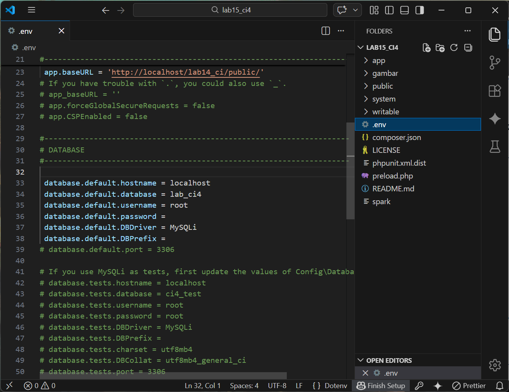
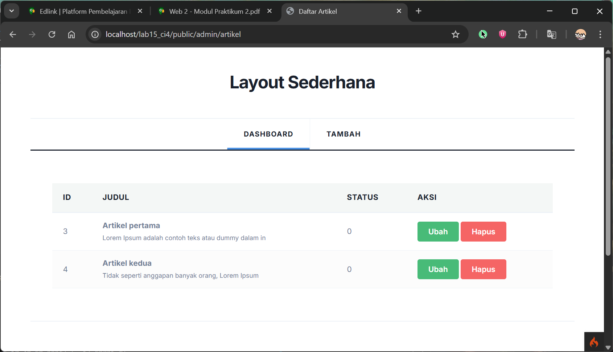
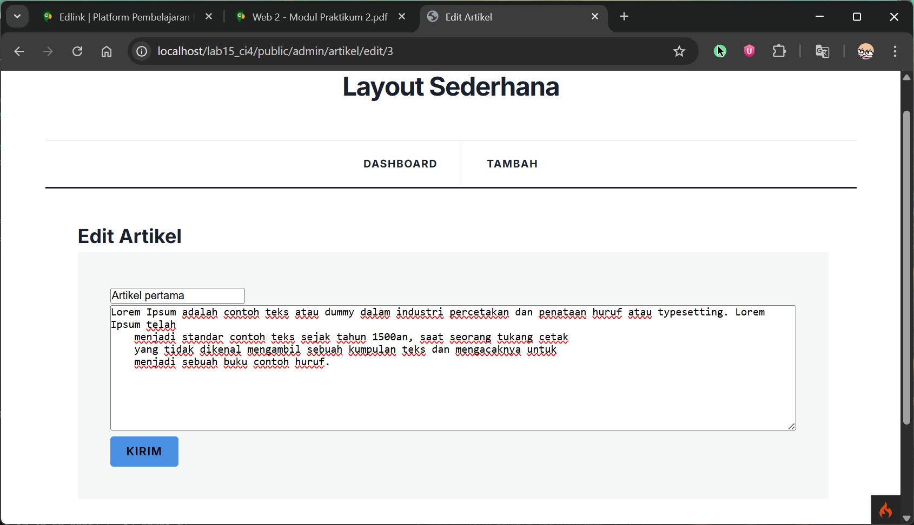
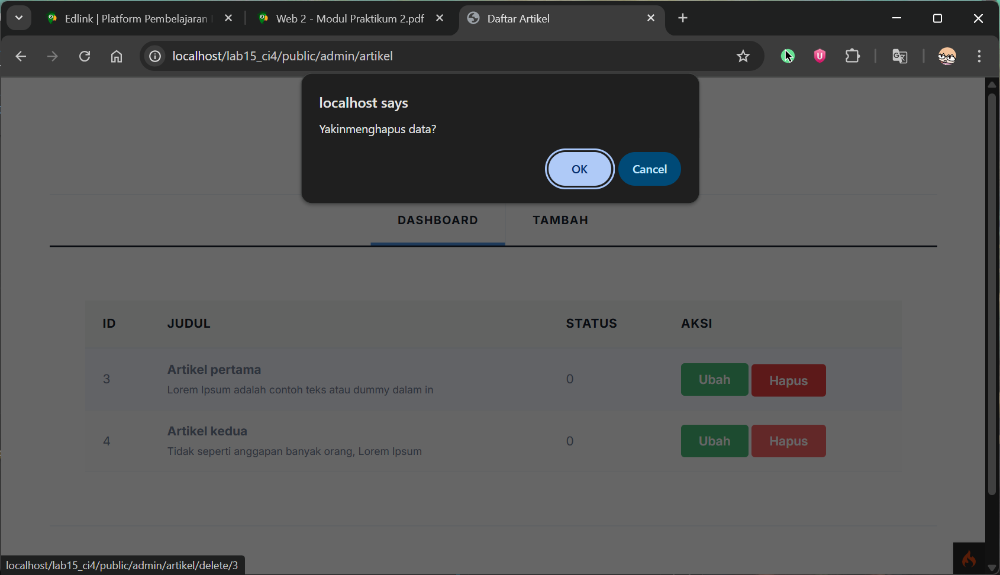
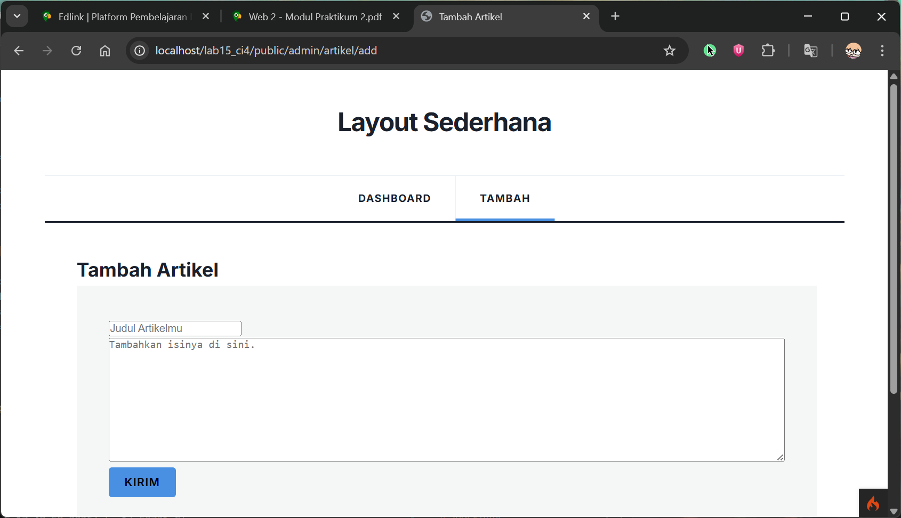
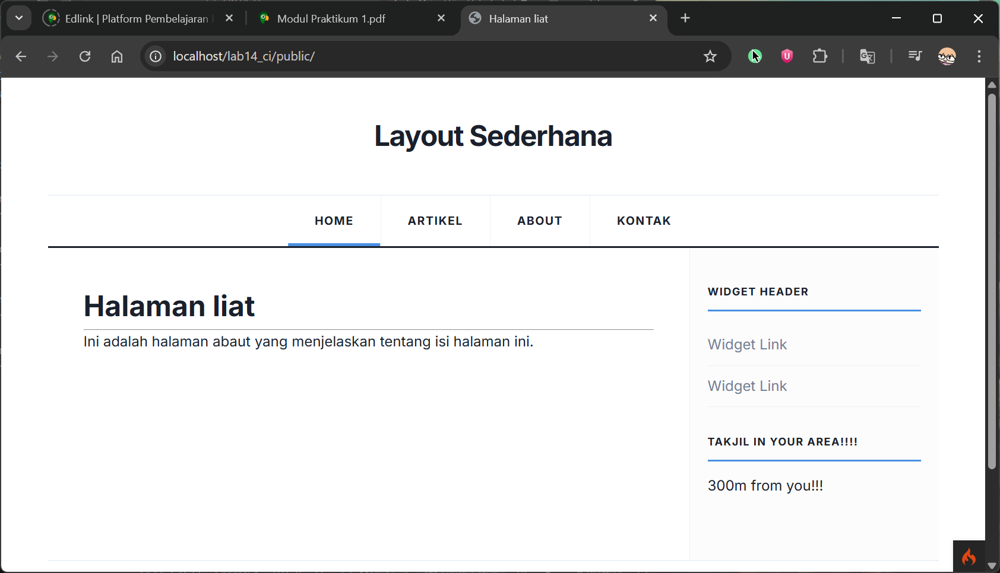
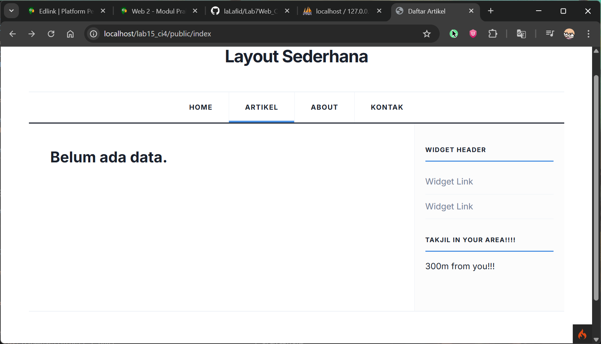
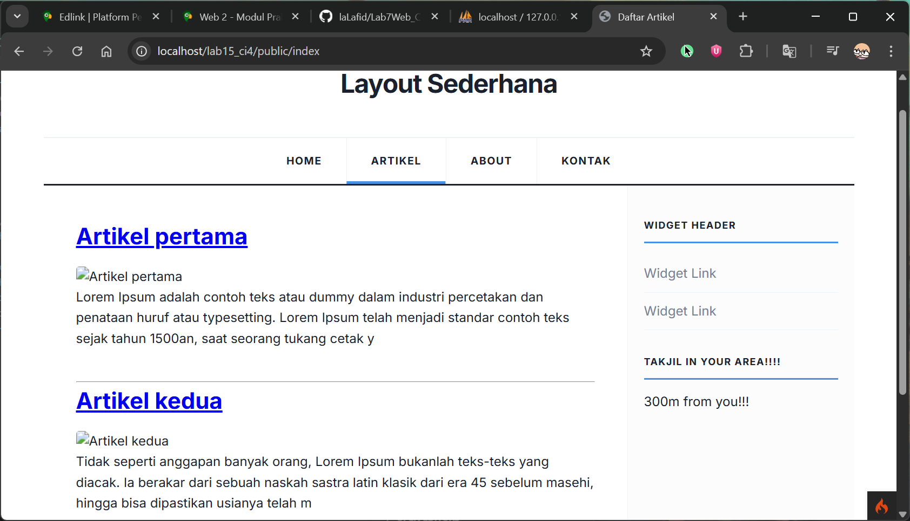
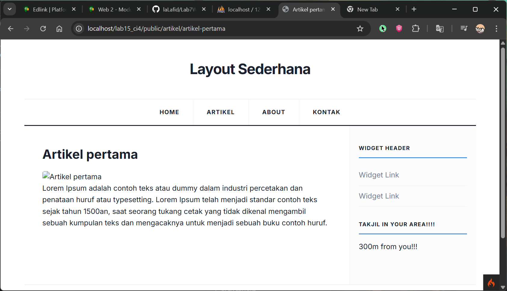
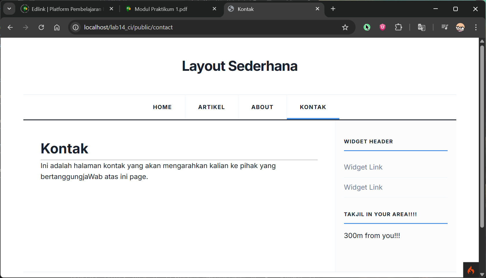

# Lanjut pake Codeigniter 4

untuk WebApp simple
 lanjutan dari [Lab7Web_CI4](https://github.com/laLafid/Lab7Web_CI4?tab=readme-ov-file)

## Langkah-langkah 

1. **Persiapan**
    - Editornya, misal Visual Studio Code.
    
    
    - XAMPP, kalo belum punya unduh dulu di [sini](https://www.apachefriends.org/).

    - Buka XAMPP control panel dulu, aktifin ``apache`` dan ```mysql```


2. **Penerapan**

    - Buat db ```lab_ci4``` dan tabel didalamnya

    ```sql
    CREATE TABLE artikel (
    id INT(11) auto_increment,
    judul VARCHAR(200) NOT NULL,
    isi TEXT,
    gambar VARCHAR(200),
    status TINYINT(1) DEFAULT 0,
    slug VARCHAR(200),
    PRIMARY KEY(id)
    );
    ``` 

    - Set up [.env](.env) nya biar baca db
    

    - Buat model untuk proses data artikel, di dalam folder ```app/models``` buat [ArtikelModel.php](app/models/modelartikel.php)

    - Buat controller nya juga di ```app/controllers``` bikin ```Artikel.php``` di dalamnya tambahin kode ini
    ```php
    public function index()
    {
        $title = 'Daftar Artikel';
        $model = new ArtikelModel();
        $artikel = $model->findAll();
        return view('artikel/index', compact('artikel', 'title'));
    }
    ```
    ```php
    public function view($slug)
    {
        $model = new ArtikelModel();
        $artikel = $model->where([
            'slug' => $slug
        ])->first();
        // Menampilkan error apabila data tidak ada.
        if (!$artikel) {
            throw PageNotFoundException::forPageNotFound();
        }
        $title = $artikel['judul'];
        return view('artikel/detail', compact('artikel', 'title'));
    }
    ```
    ```php
    public function admin_index()
    {
        $title = 'Daftar Artikel';
        $model = new ArtikelModel();
        $artikel = $model->findAll();
        return view('artikel/admin_index', compact('artikel', 'title'));
    }
    ```
    ```php
    public function add()
    {
        // validasi data.
        $validation = \Config\Services::validation();
        $validation->setRules(['judul' => 'required']);
        $isDataValid = $validation->withRequest($this->request)->run();
        if ($isDataValid) {
            $artikel = new ArtikelModel();
            $artikel->insert([
                'judul' => $this->request->getPost('judul'),
                'isi' => $this->request->getPost('isi'),
                'slug' => url_title($this->request->getPost('judul')),
            ]);
            return redirect('admin/artikel');
        }
        $title = "Tambah Artikel";
        return view('artikel/form_add', compact('title'));
    }
    ```
    ```php
    public function edit($id)
    {
        $artikel = new ArtikelModel();
        // validasi data.
        $validation = \Config\Services::validation();
        $validation->setRules(['judul' => 'required']);
        $isDataValid = $validation->withRequest($this->request)->run();
        if ($isDataValid) {
            $artikel->update($id, [
                'judul' => $this->request->getPost('judul'),
                'isi' => $this->request->getPost('isi'),
            ]);
            return redirect('admin/artikel');
        }
        // ambil data lama
        $data = $artikel->where('id', $id)->first();
        $title = "Edit Artikel";
        return view('artikel/form_edit', compact('title', 'data'));
    }
    ```
    ```php
    public function delete($id)
    {
        $artikel = new ArtikelModel();
        $artikel->delete($id);
        return redirect('admin/artikel');
    }
    ```

    - Buat [index.php](app/Views/index.php) di dalam folder ```app/Views```

    - Masukin data ke tabel ```artikel``` di db
    ```sql
    INSERT INTO artikel (judul, isi, slug) VALUE
    ('Artikel pertama', 'Lorem Ipsum adalah contoh teks atau dummy dalam industri percetakan dan penataan huruf atau typesetting. Lorem Ipsum telah
    menjadi standar contoh teks sejak tahun 1500an, saat seorang tukang cetak
    yang tidak dikenal mengambil sebuah kumpulan teks dan mengacaknya untuk
    menjadi sebuah buku contoh huruf.', 'artikel-pertama'),
    ('Artikel kedua', 'Tidak seperti anggapan banyak orang, Lorem Ipsum
    bukanlah teks-teks yang diacak. Ia berakar dari sebuah naskah sastra latin
    klasik dari era 45 sebelum masehi, hingga bisa dipastikan usianya telah
    mencapai lebih dari 2000 tahun.', 'artikel-kedua');
    ```

    - Tambahin route ke [Routes.php](app/Config/Routes.php)
    ```php
    $routes->get('/index', 'Artikel::index');
    $routes->get('/artikel/(:any)', 'Artikel::view/$1');

    $routes->group('admin', function($routes) {
        $routes->get('artikel', 'Artikel::admin_index');
        $routes->add('artikel/add', 'Artikel::add');
        $routes->add('artikel/edit/(:any)', 'Artikel::edit/$1');
        $routes->get('artikel/delete/(:any)', 'Artikel::delete/$1');
    });
    ```

    - Nah, buat folder artikel di ```app/Views``` isi pake [index.php](app/Views/index.php), [detail.php](app/Views/artikel/detail.php), [admin_index.php](app/Views/artikel/admin_index.php), [form_add.php](app/Views/artikel/form_add.php), [form_edit.php](app/Views/artikel/form_edit.php).

    - Di ```app/Views/template``` tambahin [admin_header.php](app/Views/template/admin_header.php) dan [admin_footer.php](app/Views/template/admin_footer.php).


3. **Hasil Akhir**

    - [Admin Dashboard](app/Views/artikel/admin_index.php)
    

    [Edit Artikel](app/Views/artikel/form_edit.php)
    

    [Delete Artikel](app/Views/artikel/form_edit.php)
    

    - [Add Artikel](app/Controllers/Artikel.php)
    
    
    - [Home](app/Views/liat.php)
    

    - [About](app/Views/about.php)
    

    - [Artikel](app/Views/artikel/index.php)
    before: 
    

    after: 
    
    

    - [Kontak](app/Views/contact.php)
    

    

## Akhir Kata

*Selamat mencoba*
